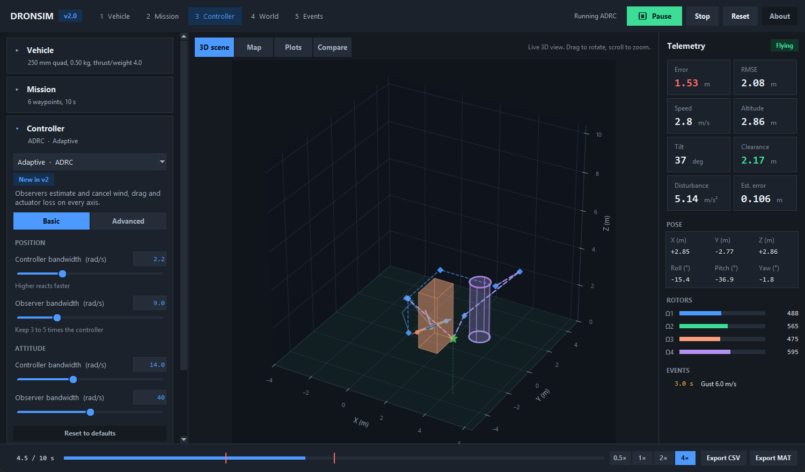
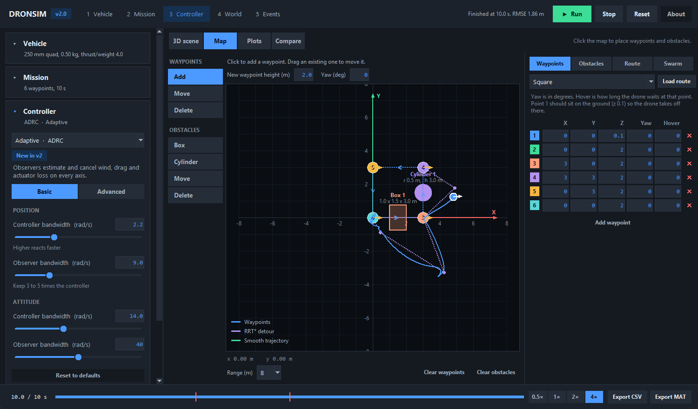
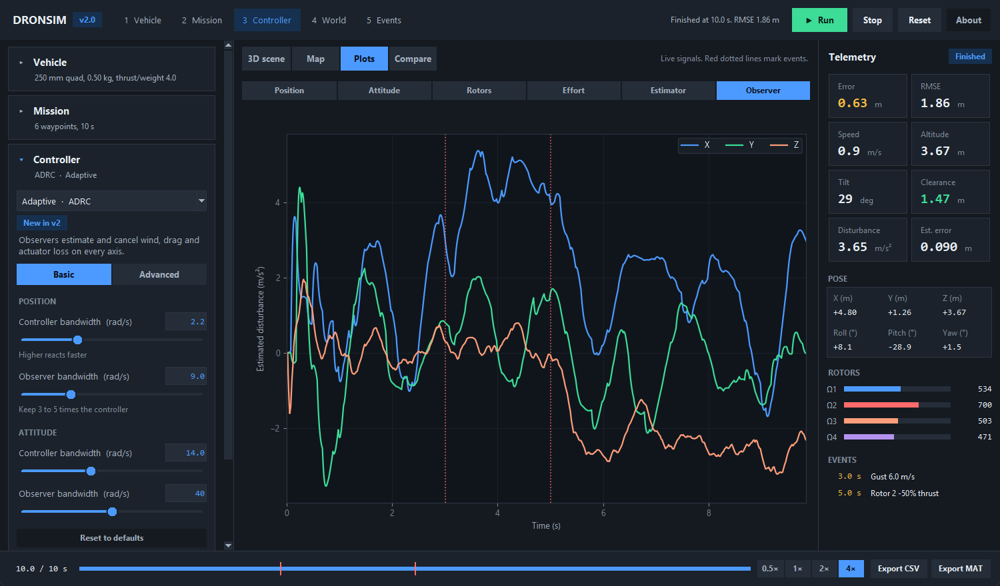
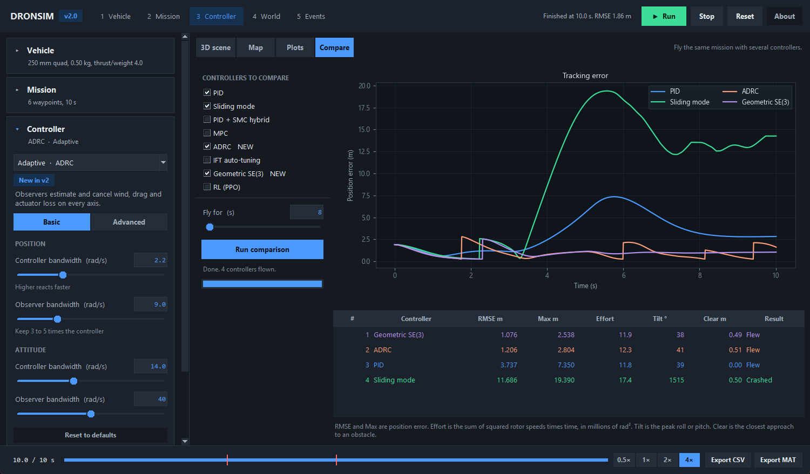

# DRONSIM — Quadrotor Drone Simulation Platform

[](https://github.com/HaikalBaiqunni/dronsim-quadrotor-sim/actions/workflows/selftest.yml)


**Version 2.0** | 6-DOF UAV simulation with eight flight controllers, sensor fusion, obstacle avoidance, swarm flights and fault injection.



---

## Quick start

```bash
git clone https://github.com/HaikalBaiqunni/dronsim-quadrotor-sim.git
cd dronsim-quadrotor-sim
pip install -r requirements.txt     # numpy, scipy, matplotlib

python drone_sim/main.py            # GUI
python drone_sim/main.py --batch    # compare all controllers, no GUI
python drone_sim/main.py --test     # self-test, 16 checks
```

`main.py` also works when started from inside `drone_sim/`. Needs Python 3.10 or newer with Tkinter (included in the python.org installer).

**"No module named numpy" although you installed it?** You probably have two Pythons (for example the
Microsoft Store one and python.org) and your editor runs the other one. `main.py` prints the interpreter it is
using and the exact `pip install` command for it. In VS Code pick the right one with
*Ctrl+Shift+P → Python: Select Interpreter*.

---

## The interface

The window follows the order you set up a flight in: **Vehicle → Mission → Controller → World → Events**, then press **Run**.

| Area | What it does |
|---|---|
| Top bar | Setup steps (click to jump), Run / Pause / Stop / Reset. Space also toggles run and pause. |
| Left sidebar | Collapsible sections. Each shows a one-line summary while closed. **Basic / Advanced** toggle on the controller hides the rarely used gains. |
| Centre tabs | **3D scene**, **Map**, **Plots**, **Compare** |
| Right column | Live telemetry: error, RMSE, speed, altitude, tilt, obstacle clearance, disturbance estimate, estimator error, pose, rotor bars, events |
| Bottom bar | Progress with event markers, speed (0.5× to 4×), export to CSV or MATLAB `.mat` |

Every control stretches with its container and text wraps instead of being cut off, down to a 1240×700 window.

| Map | Plots | Compare |
|---|---|---|
|  |  |  |

**Map** — click to place waypoints, boxes and cylinders; drag to move; right-click deletes. The right panel has an
editable waypoint table, obstacle list, trajectory and avoidance settings, and the swarm setup.
**Plots** — position, attitude, rotors, effort, estimator error, disturbance observer. Red dotted lines mark events.
**Compare** — flies the same mission (same RRT* route, same wind, same events) with several controllers and ranks them.

---

## Controllers

| Family | Controller | Notes |
|---|---|---|
| Classic | PID | Cascaded position and attitude loops, anti-windup, derivative on measurement |
| Classic | Sliding mode (SMC) | Boundary-layer SMC; error derivatives come from measured velocity and gyro |
| Classic | PID + SMC | PID position loop, SMC attitude loop |
| Predictive | MPC | Linearised model, receding horizon, projected-gradient QP |
| Adaptive | **ADRC** (new) | Extended state observers cancel wind, drag and actuator loss |
| Adaptive | IFT | PID gains tuned online from closed-loop runs |
| Geometric | **Geometric SE(3)** (new) | Attitude error on the rotation group, no Euler singularity |
| Learning | RL (PPO), experimental | Built-in numpy actor-critic that starts untrained, so it crashes until it has learned for far longer than one flight. Not part of the comparison defaults. |

### New in v2.0: research methods

| Method | Where | What it gives you |
|---|---|---|
| **ADRC** — Han (2009); Gao (2003) | `core/research_controllers.py` | Third-order linear ESO per axis (x, y, z, roll, pitch, yaw) estimates the *total* disturbance and subtracts it. The estimate is shown live as "Disturbance" and on the Observer plot. |
| **Geometric control on SE(3)** — Lee, Leok, McClamroch (2010) | `core/research_controllers.py` | Control law computed directly on the rotation matrix. Works for large tilts. |
| **Control barrier function safety filter** — Ames et al. (2019) | `core/safety.py` | Minimum-intervention filter on the setpoint that keeps a barrier `h = sdf − margin` non-negative. |
| **Sensor fusion** — Kalman filter and complementary filter (Mahony et al., 2008) | `core/estimation.py` | Simulates IMU, GPS (10 Hz) and barometer, then fuses them. With the sensor model's GPS noise of 0.25 m, the fused position error stays at a few centimetres. |
| **Fault and gust injection** | `core/simulation.py` (`ScheduledEvent`) | Reduce a rotor's thrust (10 to 100%) or add a wind gust at a chosen time. |

Honest limits:

* The estimator is a linear Kalman filter for position and velocity plus a complementary attitude filter, **not** a full 15-state EKF.
* The CBF guarantee holds for the double-integrator model the filter assumes, not the full closed-loop quadrotor; the safety margin absorbs the mismatch. A CBF alone can get stuck behind a large obstacle, so use **RRT\*+CBF**.
* There is no fault-tolerant controller. Rotor faults are *injected* so you can see which controllers cope (ADRC and PID survive a 50% loss; SMC and PID+SMC do not).
* ADRC and geometric control have no reference feedforward, so on fast moving references (circle) SMC can beat them.

### Obstacle avoidance

| Mode | Behaviour |
|---|---|
| None | Straight through everything |
| APF | Reactive push away from obstacles. Can stall. |
| RRT* | Plans a detour for every waypoint segment that hits an obstacle and splices it into the route |
| APF+RRT | RRT* route plus APF push |
| CBF | Safety filter only |
| **RRT\*+CBF** | RRT* route plus CBF filter. Recommended: reaches the goal and keeps the margin. |

Swarm flights use RRT* and CBF per drone; APF is single-drone only. Drones also keep a minimum separation from each other (CBF on the relative position, using shared positions and velocities, with a small sideways bias so head-on pairs pass instead of deadlocking). In a three-drone head-on swap this turns near-collisions (0.01 to 0.2 m) into 0.4 to 1.0 m gaps for a 0.8 m setting; it is a soft guarantee, not a hard one.

---

## Architecture

```
drone_sim/
├── core/
│   ├── dynamics.py               # 6-DOF quadrotor dynamics (RK4)
│   ├── environment.py            # Wind, Dryden turbulence, ground effect, gusts, noise
│   ├── controllers.py            # PID, SMC, PID+SMC + mixer
│   ├── advanced_controllers.py   # MPC, IFT, RL
│   ├── research_controllers.py   # ADRC, geometric SE(3)            (new)
│   ├── estimation.py             # sensors + Kalman / complementary  (new)
│   ├── safety.py                 # CBF safety filter                 (new)
│   ├── catalog.py                # controller catalogue + parameters (new)
│   ├── mission.py                # waypoints, RRT* splicing, sim factory (new)
│   ├── compare.py                # headless comparison               (new)
│   ├── obstacles.py              # obstacles, APF, RRT*
│   ├── trajectory.py             # polynomial / min-snap trajectories
│   ├── simulation.py             # single-drone engine, logger, events
│   └── swarm.py                  # multi-drone engine
├── gui/
│   ├── app.py                    # main window
│   ├── sidebar.py                # Vehicle, Mission, Controller, World, Events
│   ├── scene_canvas.py           # 2D map editor and live map
│   ├── inspector.py              # waypoints, obstacles, route, swarm
│   ├── plots.py                  # 3D scene, live signals, compare
│   ├── telemetry.py              # telemetry column, timeline
│   ├── widgets.py, theme.py      # shared widgets and styling
│   └── drone_3d.py, obstacle_render.py
├── docs/                         # screenshots
├── main.py
└── requirements.txt
```

The GUI only talks to `core` through `build_controller`, `build_simulation` and `run_comparison`, so scripts get the same behaviour:

```python
from drone_sim.core.catalog import build_controller
from drone_sim.core.mission import MissionSpec, build_simulation
from drone_sim.core.dynamics import DroneParams
from drone_sim.core.environment import EnvironmentParams, WindCondition

dp = DroneParams()
env = EnvironmentParams(wind_condition=WindCondition.MODERATE)
spec = MissionSpec(kind="preset", preset="circle", duration=30)
built = build_simulation(spec, build_controller("ADRC", dp), dp, env,
                         use_estimator=True, real_time=False)
built.sim.start()                      # runs in a background thread
```

---

## Physics model

State (12-DOF): position, velocity, Euler angles (roll, pitch, yaw), body rates.

```
ṗ  = v
v̇  = (1/m)[R·F_thrust + F_drag] + g·ẑ_world
Φ̇  = W(Φ)·ω_body
ω̇  = I⁻¹[τ − ω × (I·ω) − Γ_gyro + τ_drag]
```

| Parameter | Value |
|---|---|
| Mass | 0.50 kg (adjustable 0.3 to 1.2 kg, inertia scales with it) |
| Ixx = Iyy, Izz | 4.9×10⁻³, 8.8×10⁻³ kg·m² |
| Arm length | 0.23 m |
| kT, kD | 4.905×10⁻⁶, 9.81×10⁻⁸ |
| Hover speed / max speed | 500 / 1000 rad/s |

Integration: RK4 at 100 Hz.

### Environment

* **Wind** — steady drag force from relative velocity, five levels, adjustable direction.
* **Dryden turbulence** (MIL-HDBK-1797B).
* **Ground effect** — Cheeseman and Bennett; the factor is clamped so it stays finite near the ground.
* **Gusts** — scheduled bursts of wind (Events section).
* **Sensors** — ideal, raw noisy, or fused (IMU + GPS + barometer).

---

## Self-test and batch runner

`python drone_sim/main.py --test` checks hover physics, every controller in calm air, sensor-noise survival, the
estimator, 50% rotor loss and RRT\*+CBF avoidance. `--batch` prints an RMSE table for every controller on hover and circle
missions with moderate wind.

---

## Roadmap

- [x] RL controller, MPC, multi-drone, obstacle avoidance (v1.x)
- [x] ADRC, geometric SE(3), CBF filter, sensor fusion, fault injection, controller comparison (v2.0)
- [x] Drone-to-drone separation in swarms
- [ ] Full 15-state EKF
- [ ] Reference feedforward for ADRC and geometric control
- [ ] Fault-tolerant control after rotor loss
- [ ] LQR, MPPI, learned residual dynamics
- [ ] Modern web-style UI (NiceGUI + three.js): guided setup, studio view, run comparison and replay. See the mockups in [docs/ui-plan.md](docs/ui-plan.md).
- [ ] Quaternion state in the dynamics
- [ ] ROS2 bridge, hardware-in-the-loop

---

## References

1. Han, J. (2009). From PID to active disturbance rejection control. *IEEE Trans. Industrial Electronics* 56(3).
2. Gao, Z. (2003). Scaling and bandwidth-parameterization based controller tuning. *ACC 2003*.
3. Lee, T., Leok, M., McClamroch, N. H. (2010). Geometric tracking control of a quadrotor UAV on SE(3). *IEEE CDC*.
4. Ames, A. D. et al. (2019). Control barrier functions: theory and applications. *ECC 2019*.
5. Mahony, R., Hamel, T., Pflimlin, J.-M. (2008). Nonlinear complementary filters on the special orthogonal group. *IEEE TAC* 53(5).
6. Karaman, S., Frazzoli, E. (2011). Sampling-based algorithms for optimal motion planning. *IJRR* 30(7).
7. Mellinger, D., Kumar, V. (2011). Minimum snap trajectory generation and control for quadrotors. *ICRA*.
8. Mahony, R., Kumar, V., Corke, P. (2012). Multirotor aerial vehicles. *IEEE RAM*.
9. Utkin, V. I. (1992). *Sliding Modes in Control and Optimization*. Springer.
10. Hjalmarsson, H. et al. (1998). Iterative feedback tuning: theory and applications. *IEEE CSM*.
11. Schulman, J. et al. (2017). Proximal policy optimization algorithms. arXiv:1707.06347.
12. MIL-HDBK-1797B (2012). *Flying Qualities of Piloted Vehicles*.
13. Cheeseman, I. C., Bennett, W. E. (1955). The effect of the ground on a helicopter rotor in forward flight. ARC R&M 3021.
